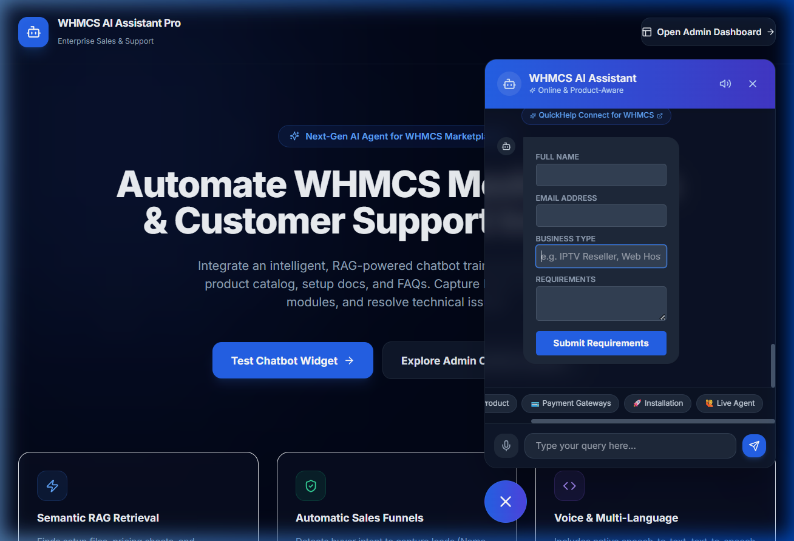
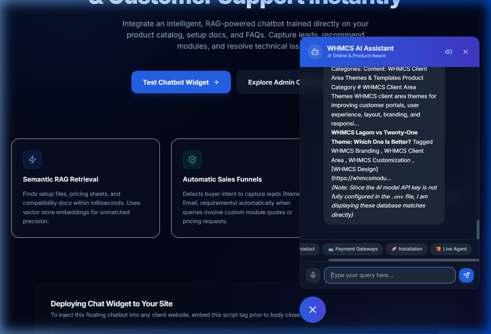

# WHMCS AI Assistant Pro 🤖

An enterprise-grade, RAG-powered Sales Assistant and Customer Support Agent designed for WHMCS module digital product marketplaces.

## 🚀 Key Features

* **Website Data Scraper**: Python crawler that parses sitemaps, scrapes product pages, reviews documentation, and maps WordPress guides into structured JSON format.
* **Vector RAG Pipeline**: LangChain-powered retrieval using local Chroma vector databases and embeddings (`sentence-transformers` or OpenAI).
* **Multi-LLM Switcher**: Instantly switch between OpenAI GPT, Gemini, Claude, and Llama/Ollama models via simple environment variables.
* **Premium Floating Chat Widget**: Modern Next.js glassmorphic UI overlay with support for typing indicators, suggestion chips, product links, and voice dictation.
* **Automatic Lead Funnels**: Automatically detects purchase/custom development intent to collect visitor name, email, business, and specifications.
* **Voice Assistant Integration**: Interactive client-side Speech Recognition with backend base64 Text-to-Speech (TTS) audio synthesizer feedback.
* **Admin Dashboard**: Real-time traffic analytics line-charts, lead tables, unresolved inquiry logs (knowledge gaps), and crawler control switches.

---

## 📸 Application Screenshots

### 1. Landing Page with Floating Chat Widget


### 2. Interactive AI Chat Support & Fallback


---

## 📂 Project Repository Structure

```
/
├── backend/
│   ├── app/
│   │   ├── api/          # Endpoints (/chat, /search, /recommend, /lead, /products, /health)
│   │   ├── chatbot/      # Agent system, memory prompts, long-term memory
│   │   ├── database/     # Database models, ORM connection helpers
│   │   ├── authentication/ # JWT security services
│   │   ├── rag/          # Embeddings and vector store helpers
│   │   └── main.py       # FastAPI entry point
│   ├── requirements.txt
│   └── Dockerfile
├── scraper/
│   ├── crawler.py        # Sitemap & link page crawler
│   ├── extractor.py      # BeautifulSoup HTML node scraper
│   ├── cleaner.py        # Raw text to markdown formatting converter
│   └── scheduler.py      # Periodical cron schedule worker
├── frontend/
│   ├── app/              # Next.js App Router (Dashboard pages, widget endpoint)
│   ├── components/       # Chat widget, product cards, dashboard charts, analytics cards
│   ├── public/           # Static embed widget.js script
│   ├── package.json
│   ├── tailwind.config.js
│   └── Dockerfile
├── docker/
│   └── docker-compose.yml
├── .github/
│   └── workflows/
│       └── ci-cd.yml     # CI/CD GitHub Actions pipeline
├── tests/
│   ├── test_scraper.py   # Scraper/extractor tests
│   ├── test_api.py       # FastAPI routing tests
│   └── test_rag.py       # Embeddings and text split tests
├── requirements.txt       # Global python requirements
├── .env.example           # Shared environment configurations
└── README.md
```

---

## 🛠️ Local Installation & Development

### 1. Configure Environment Variables
Copy `.env.example` to `.env` and fill in your API credentials:
```bash
cp .env.example .env
```
Ensure your `GEMINI_API_KEY` or `OPENAI_API_KEY` is present. By default, the system uses local `sentence-transformers` for embeddings so no OpenAI key is required to test local retrieval.

### 2. Set Up the Python Backend
Create a virtual environment, install requirements, and boot up the FastAPI server:
```bash
# Create and activate virtual environment
python -m venv venv
source venv/bin/activate  # On Windows: .\venv\Scripts\activate

# Install dependencies
pip install -r requirements.txt

# Run FastAPI dev server
uvicorn backend.app.main:app --reload --port 8000
```
This automatically boots the server, configures a local SQLite database (`whmcs_ai.db`), and seeds a default administrative user:
* **Username**: `admin`
* **Password**: `adminpassword123`

### 3. Run the Scraper (Crawler & Ingestion)
To scrape the live `https://whmcsmodules.org/` website and load products/guides into the vector database, execute the scraper script:
```bash
python -m scraper.scheduler
```
This crawls the target URL, extracts module specs, prices, and guide contents, saves them in SQLite, and indexes vector embeddings into `./chroma_db/`.

### 4. Build and Run the Next.js Frontend
Navigate to the frontend folder, install Node packages, and start the development server:
```bash
cd frontend
npm install
npm run dev
```
Open your browser to:
* **Demo Store Landing Page**: `http://localhost:3000` (shows marketing pages and floating widget)
* **Admin Dashboard**: `http://localhost:3000/dashboard` (log in using `admin` / `adminpassword123`)

---

## 🧪 Running Automated Tests
We use `pytest` for all backend, crawler, and RAG verification:
```bash
pytest tests/
```

---

## 🐳 Docker Production Deployment
To spin up the entire production-grade stack including the backend server, frontend, PostgreSQL, and Redis databases using Docker Compose:
```bash
cd docker
docker-compose up --build -d
```
The stack exposes:
* **FastAPI Server**: `http://localhost:8000`
* **Next.js Site & Dashboard**: `http://localhost:3000`
